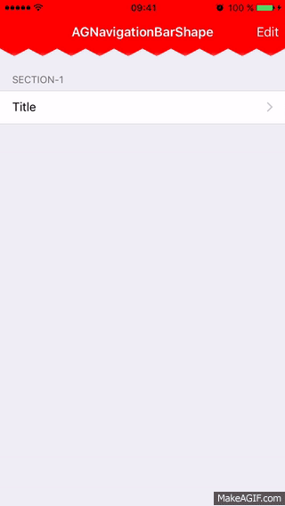
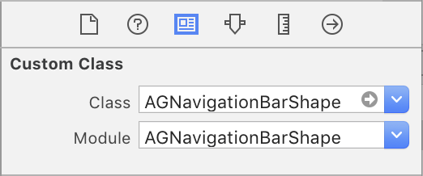
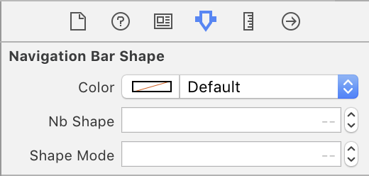

# AGNavigationBarShape

[](https://travis-ci.org/grifas/AGNavigationBarShape)
[](http://cocoapods.org/pods/AGNavigationBarShape)
[](http://cocoapods.org/pods/AGNavigationBarShape)
[](http://cocoapods.org/pods/AGNavigationBarShape)
[](https://developer.apple.com/swift)

[]

<!--https://img.shields.io/cocoapods/dt/AFNetworking.svg-->
<!--CocoaPods: 		https://img.shields.io/cocoapods/dm/AFNetworking.svg-->
<!--CocoaPods: 		https://img.shields.io/cocoapods/dw/AFNetworking.svg-->

iOS Navigation Bar with customs shapes (Zigzag, Wave and Square) written in Swift 2.



To run the example project, clone the repo, and run `pod install` from the Example directory first.

## Installation

####CocoaPods

AGNavigationBarShape is available through [CocoaPods](http://cocoapods.org). To install
it, simply add the following line to your Podfile:

```ruby
pod "AGNavigationBarShape"
```

####Manually
Add the `AGNavigationBarShape.swift` file to your project. 

##Usage

###Setup

Add `import AGNavigationBarShape` in your file

In your app delegate:

```swift
func application(application: UIApplication, didFinishLaunchingWithOptions launchOptions: [NSObject: AnyObject]?) -> Bool {
// Override point for customization after application launch.

let rootViewController = UIStoryboard.init(name: "Main", bundle: nil).instantiateInitialViewController()
let navController = UINavigationController(navigationBarClass: AGNavigationBarShape.self, toolbarClass: nil)

(navController.navigationBar as? AGNavigationBarShape)?.mode = .Zigzag
(navController.navigationBar as? AGNavigationBarShape)?.color = UIColor.purpleColor()
(navController.navigationBar as? AGNavigationBarShape)?.cycles = 5

navController.viewControllers = [rootViewController!]

window?.rootViewController = navController
window?.makeKeyWindow()
return true
}
```

####Storyboard Support

1. Add `AGNavigationBarShape` Class and Module to UINavigationController's navigationBar in Identity Inspector



2. If you want to custom it, set options in the Attributes Inspector tab



## Features
-  Choose shape mode (0: Zigzag, 1: Wave, 2: Square) (Zigzag by default)
-  Custom number of cycle (9 by default)
-  Custom background color (orange by default) 

## Author

Aurelien Grifasi, aurelien.grifasi@gmail.com

## License

AGNavigationBarShape is available under the MIT license. See the LICENSE file for more info.
